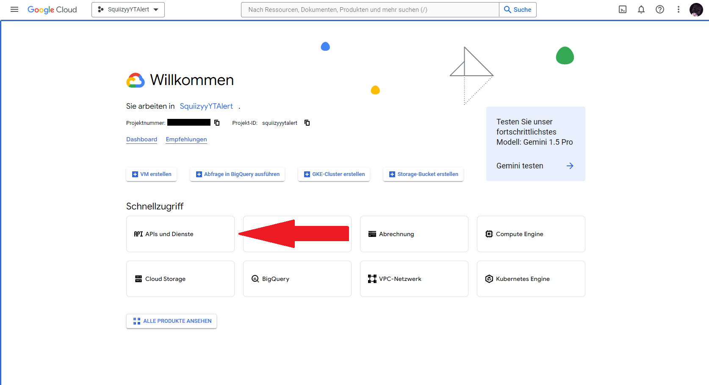
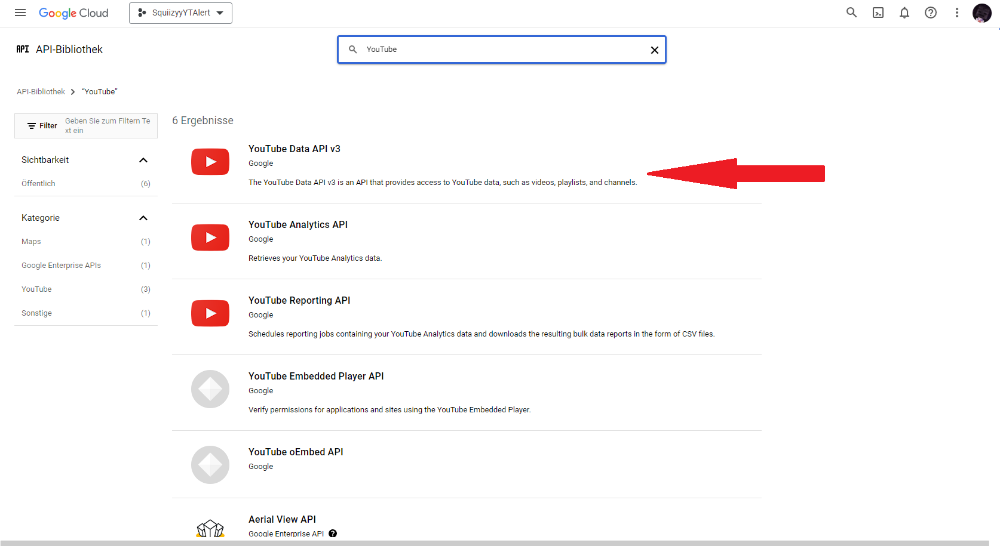

# SquiizyyBot 
## Archiviert

## Idee
Die Idee war es einen Discord Bot zu entwickeln der auf Discord eine Benachrichtigung sendet, wenn der Streamer xSquiizyy ein neues Video bzw. Short hochlädt.

## Umsetzung
Das Projekt wurde letztendlich mit Java und der Java Discord API (JDA v5.0.0-beta.24 -> [Github](https://github.com/discord-jda/JDA)) umgesetzt. Es wurde die offizielle YouTube API genutzt. 

## Setup
Hier ist ein kleines Beispiel wie man die YouTube Alerts und den Bot aufsetzen kann:
<procedure title="Bot aufsetzen" id="setup-bot">
    <step>
        
Erstellen sie eine Application auf dem <a href="https://discord.com/developers/applications">Discord Developer Portal</a>

    </step>
    <step>
        
Füge den Token in der Token.java Klasse im Projekt ein. (<a href="https://github.com/construktdev/squiizyybot">Projekt Source</a>)

    </step>
</procedure>

<procedure title="YouTube Alerts aufsetzen" id="setup-yt">
    <step>
        
Gehen Sie auf das Google Console Dashboard und melden Sie sich an.

    </step>
    <step>
        
Erstellen sie ein neues Projekt und fügen sie die YouTube API hinzu

        </img>
        </img>
    </step>
    <step>
        
Erstellen Sie einen API Key und fügen ihn im Projekt in der Klasse Main ein.

    </step>
</procedure>

